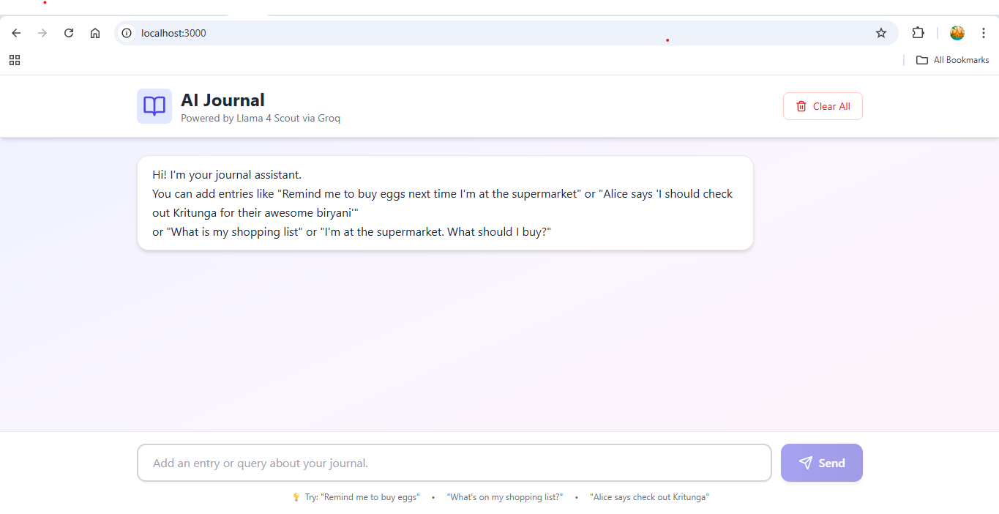

# Journal Chat Interface

A conversational journal application built with Vercel AI SDK, Next.js, and GROQ that allows users to manage journal entries through natural language.

### Demo



## Features

- **Natural Language Entry Creation**: Add journal entries conversationally
  - Shopping lists: "Remind me to buy eggs next time I'm at the supermarket"
  - Recommendations: "Alice says 'Check out Kritunga for biryani'"
  - General notes: Any text-based entry
  
- **Smart Querying**: Retrieve entries using natural language
  - "What's on my shopping list?"
  - "I'm at the supermarket, what should I buy?"
  - Category-based filtering
  
- **Hallucination Protection**: Built-in safeguards to keep interactions journal-focused
  - Rejects non-journal queries like "What is 2+2?"

- **Context Management**: Handles long conversations efficiently
  - Maintains full chat history in UI

## Tech Stack

- **Framework**: Next.js 14 (App Router)
- **AI SDK**: Vercel AI SDK
- **LLM**: Llama 4 Scout
- **UI**: React with Tailwind CSS
- **Icons**: Lucide React

## Prerequisites

- Node.js 18+ 
- npm or yarn
- GROQ API Key

## Installation

1. **Clone the repository**
```bash
git clone <repository-url>
cd journal-chat-app
```

2. **Install dependencies**
```bash
npm install
```

3. **Set up environment variables**

Create a `.env.local` file in the root directory:
```bash
GROQ_API_KEY=your_groq_api_key_here
```

4. **Run the development server**
```bash
npm run dev
```

5. **Open your browser**
Navigate to `http://localhost:3000`

## Project Structure

```
ai-journal-app/
├── app/
│   ├── api/
│   │   └── chat/
│   │       └── route.ts          # API route for chat completion
│   └── globals.css               # Global style file
│   ├── layout.tsx                # Root layout
│   └── page.tsx                  # Main chat interface
├── assets/                       # Contain all assets files
├── components/
│   ├── Header/
│   │   └── Header.tsx            # Header component
│   ├── Input/
│   │   └── Input.tsx             # User Input component
│   ├── Message/
│   │   └── Message.tsx           # Chat message display component
├── .env.local                    # Environment variables
├── .gitignore
├── package.json
└── postcss.config.js
├── next.config.js
└── tailwind.config.js
└── tsconfig.json
```

## Usage Examples

### Adding Entries

```
User: Remind me to buy eggs next time I'm at the supermarket
Assistant: I've added a new journal entry:
  Category: reminder
  Entry: Remind me to buy eggs next time I'm at the supermarket
  You can view your reminders by asking "What are my reminders?" or "List my reminders".
  What's next?
```

### Querying Entries

```
User: What is my shopping list
Assistant: Let me check your journal entries...
  Your current shopping list:
  Eggs
  You have 1 item on your shopping list.
  Would you like to add something to your shopping list or view other journal entries?
```

### Handling Non-Journal Queries

```
User: What is 2+2?
Assistant: I'm only a journal assistant. I can help you add, search, or organize your journal entries.
```

## Implementation Details

### Hallucination Protection

Multiple layers of protection:

1. **System Prompt**: Clear instructions about capabilities and limitations
2. **Response Validation**: Checks for inappropriate responses before display

### Context Window Management

- Maintains full conversation history in client-side (browser) in memory

### Server Memory

Journal entries are stored in a server-side singleton object:
- Persists for the duration of the server process
- Resets on server restart (as specified in requirements)
- Can be easily swapped for database persistence

## API Routes

### POST `/api/chat`

Handles chat messages and executes journal operations.

**Request Body:**
```json
{"id":"h1PmE07wMMWWhUu7","messages":[{"id":"welcome","role":"assistant","parts":[{"text":"Hi! I'm your journal assistant. \n          You can add entries like \"Remind me to buy eggs next time I'm at the supermarket\" or \"Alice says 'I should check out Kritunga for their awesome biryani'\" \n          or \"What is my shopping list\" or \"I'm at the supermarket. What should I buy?\"","type":"text"}]},{"parts":[{"type":"text","text":"Remind me to buy eggs next time I'm at the supermarket"}],"id":"9ummps8Wk3DYxMmC","role":"user"}],"trigger":"submit-message"}
```

**Response:**
Stream of AI responses with function calls embedded.

## Customization

### Adding New Categories

Edit `app/api/chat/route.ts` to add new entry categories:

```typescript
const SYSTEM_PROMPT = Modify categories under text `Categories:`;
```

### Modifying AI Behavior

Edit the system prompt in `app/api/chat/route.ts`:

```typescript
const SYSTEM_PROMPT = `Your custom instructions here...`;
```

### Styling

The app uses Tailwind CSS. Customize styles in:
- `app/page.tsx` - Component-level styling
- `tailwind.config.js` - Global theme configuration

## Limitations & Known Issues

1. **Memory Storage**: Entries are lost on server restart or page refresh
2. **No Authentication**: Single-user experience only
3. **Rate Limits**: Subject to OpenAI API rate limits
4. **Context Length**: Very long conversations may hit token limits

## Future Enhancements

- [ ] Database persistence (PostgreSQL/MongoDB)
- [ ] User authentication and multi-user support
- [ ] Entry editing and deletion
- [ ] Search and filtering UI
- [ ] Export journal entries
- [ ] Scheduled reminders with notifications
- [ ] Rich text formatting
- [ ] Attachment support

## Troubleshooting

### "API key not found or Invalid API Key"
Ensure `.env.local` exists with valid `GROQ_API_KEY`

### "Module not found" errors
Run `npm install` to install all dependencies

### Slow responses
Check your GROQ API quota and rate limits

---
